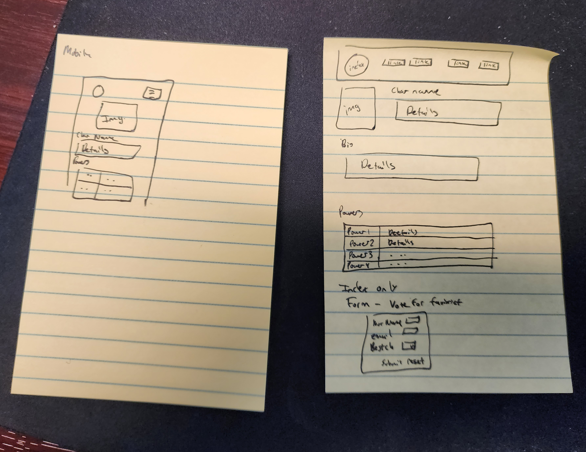

# Promineo Week 7 Homework

This is my homework for week 7 of the Promineo Front End Development Bootcamp. 

## Table of contents

- [Overview](#overview)
  - [Links](#links)
- [My process](#my-process)
  - [What I learned](#what-i-learned)
- [Author](#author)


## Overview

Coding Steps:
	•	Create a website using only HTML. The website can be anything you like (within school guidelines) if it meets the following criteria:
	•	At least 3 pages with links to navigate between all pages present on each page.
	•	2 different size headers, list, 3 images, table, and a form.


### Links
- Live Site URL: [Live Site On GitHub Pages](https://barnettet31.github.io/promineo-week-6/)

## My process
First I started with a picture of what I wanted the page structure to look like. Here's a picture of that: 



Then I layed out the basic HTML. Honestly this project was so easy that I had to make it at least a little presentable so I added some styles...

Then I kinda wanted to give the page some actual functionality (the mobile site) so I may have added some JS to the page as well 

### What I learned
I already knew most of this but decided to challenge myself by adding an animation to the navigation links at the top.

I did that like this: 

```css 
.nav_item::after{
    content: "";
    background-image: url('./graphics/Flying_Nimbus.webp');
    background-repeat: no-repeat;
    position: absolute;
    bottom: -17px;
    left: 0;
    height: 23px;
    width: 100%;
    transform: translateX(0);
    visibility: hidden;
    transform-origin: left;
    transition: transform linear 0.3s;
}
.nav_item:hover::after{
    visibility: visible;
    transform: translateX(70%);
}
```


## Author

- Twitter - [@barnett_travis5](https://twitter.com/barnett_travis5)
- LinkedIn - [@travis-barnette-ba7987237](https://www.linkedin.com/in/travis-barnette-ba7987237/)
